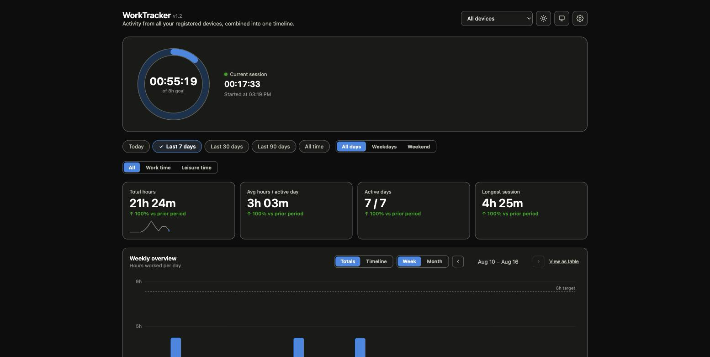

# WorkTracker

A personal work-time tracker: lightweight desktop trackers record keyboard/mouse
activity timestamps only (never key content or window titles), a Node.js/TypeScript
server turns those timestamps into work sessions, and a dashboard visualizes them.

## Why

I wanted a simple, unfussy answer to a question I kept asking myself: how much time
do I actually spend at the computer — for work, for personal use, and combined? The
line between the two is often blurry, so instead of two separate numbers I wanted a
tool that could capture both and still keep them apart cleanly, depending on which
answer I needed at the moment.



## How this was built

Every line of code in this repository was written by Claude Code, Anthropic's AI
coding agent — not typed by me. My role was that of an orchestrator: I made the
architecture decisions, defined the scope, reviewed every change, and did the
quality assurance myself.

In practice that meant: when the original spec hit a limit — for example, when it
turned out mid-development that device settings needed to be configurable
per-device rather than globally — deciding how to resolve that was my call, not the
agent's. I tested every deployment stage myself against the actually running
application, rather than accepting a green automated test suite as sufficient
proof. And in several places I deliberately kept the scope narrow — no multi-user
support, no tracking of window titles or application names — because that would
have worked against the tool's actual purpose.

A complete, unedited log of the technical and product decisions made during
development lives in `docs/IMPLEMENTATION_NOTES.md`.

## Status

WorkTracker runs in production at
[worktracker.accessible-places.org](https://worktracker.accessible-places.org) and
I use it daily to track my own work time.

## Architecture

```
Windows tracker ─┐
                  ├─ HTTPS, Authorization: Bearer <api-key> ─▶ Vercel Functions (Hono) ─▶ Postgres
Mac tracker      ─┘                                                   │
                                                                       ▼
                                                        Dashboard (static HTML/CSS/JS)
```

- **Server** (`src/server/`, `api/index.ts`) — a single Hono app bundled into one
  catch-all Vercel Function, covering event ingestion, stats, settings, and device
  management. See `docs/API_CONTRACT.md` for the exact endpoint shapes.
- **Core** (`packages/core/`) — pure, framework-free business logic: turning raw
  activity timestamps into sessions, daily/weekly/monthly aggregation, statistics.
  See `docs/SESSION_LOGIC_SPEC.md` for the session-detection rules.
- **Database** — Postgres (Vercel Marketplace, e.g. Neon). Schema in
  `src/server/db/schema.sql`.
- **Dashboard** (`public/`) — static HTML/CSS/JS, no framework or build step, served
  by Vercel and talking to the API via `fetch()`. Password-protected.
- **Mac tracker** (`mac-tracker/`) — native Swift/AppKit menu-bar app. Buildable and
  testable on macOS only; see `mac-tracker/README.md`.
- **Windows tracker** (`windows-tracker/`) — .NET/WinForms tray app. The
  platform-independent core (`WorkTrackerTracker.Core`) is built and tested
  cross-platform; the tray/`GetLastInputInfo` shell (`WorkTrackerTracker.App`)
  compiles on macOS but has not yet been run — see `windows-tracker/README.md`.

## Development

```sh
npm install
npm run build        # compiles packages/core
npm test              # runs the vitest suite (packages/core + src/server)
npm run typecheck
```

Copy `.env.example` to `.env.local` and fill in `DATABASE_URL`, `APP_TIME_ZONE`,
`DASHBOARD_PASSWORD`, and `DASHBOARD_SESSION_SECRET` for local development — or,
if the project is already linked to Vercel (`vercel link`), just run
`vercel env pull .env.local` to grab the real values (including the live
Neon `DATABASE_URL`) instead of typing them by hand.

```sh
npm run db:apply-schema   # applies src/server/db/schema.sql to DATABASE_URL
npm run dev               # local server + dashboard at http://localhost:3000, using .env.local
```

`npm run dev` runs `src/server/devServer.ts` (a plain Node HTTP server via
`@hono/node-server`), not `vercel dev` — `vercel dev` doesn't reliably route
requests in this project's zero-config (no meta-framework) layout, see
`docs/IMPLEMENTATION_NOTES.md`. Pointing `.env.local`'s `DATABASE_URL` at the
same Neon database as production means local testing writes real rows there
— fine for a solo personal project, but worth knowing before generating a
lot of local test activity.

Deployment is via the Vercel CLI/dashboard (`vercel.json` routes all `/api/*`
traffic to the single catch-all Function `api/index.ts` — unrelated to and
unaffected by `devServer.ts`).

## Documentation

- `docs/CONCEPT.md` — architecture and stack rationale.
- `docs/DATA_MODEL.md` — entities and settings.
- `docs/SESSION_LOGIC_SPEC.md` — the business rules for turning raw activity
  timestamps into work sessions.
- `docs/API_CONTRACT.md` — REST endpoint shapes used by the dashboard.
- `docs/IMPLEMENTATION_NOTES.md` — decisions made during implementation,
  including where the build deviates from the original design docs.
